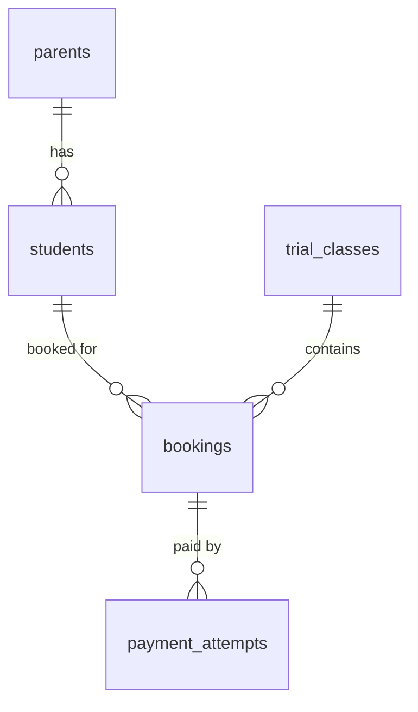
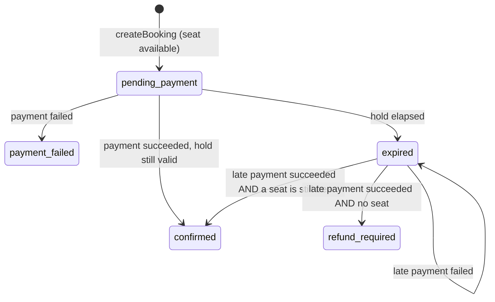
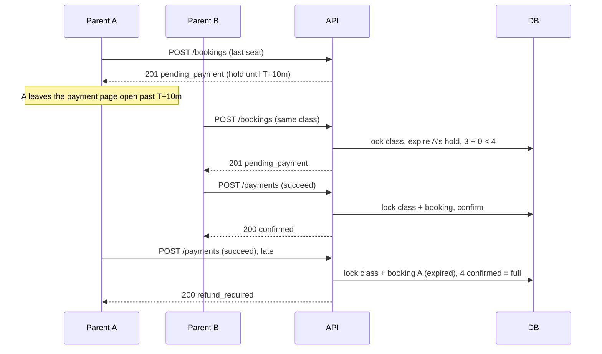

# Ottodot Trial Booking

A trial-class booking system built around one guarantee: **a trial class never has more than four
confirmed students, never has the same child twice, and never has a child whose payment failed.**
Everything else in this repo exists to make that guarantee true under concurrency, and to make it
easy for you to check.

---

## Quick start

The only prerequisite is **Docker**. No Node install, no `npm install`, no local Postgres.

```bash
git clone https://github.com/ardhianyh/trial-booking-system.git && cd trial-booking-system
docker compose up --build
```

Then open **http://localhost:5173**.

On a clean volume this brings up Postgres, waits for its healthcheck, applies both migrations
(schema + demo data), starts the API on `:3001` and the web app on `:5173`.

| Command | What it does |
|---|---|
| `docker compose up --build` | Everything. The only command you need. |
| `npm test` | Full test suite including the concurrency tests, inside the api container |
| `npm run demo:last-seat` | Deterministic narration of the brief's last-seat race |
| `npm run db:fresh` | Rebuild the schema from migrations and refresh the demo class times |
| `npm run migrate:status` | Which migrations are applied |
| `docker compose down -v` | Stop everything and delete the database volume |

Running without Docker is possible but is not the intended path: point the `DATABASE_*` variables
at a local Postgres 14+, then `npm run migrate:deploy -w server`, `npm run dev -w server` and
`npm run dev -w web`.

---

## Demo walkthrough

The seed data is built so every case the brief asks about is one click away.

| Case | How to see it |
|---|---|
| A class with seats available | **Lower Primary Math** (1/4) and **Upper Primary Math** (0/4) |
| A class with exactly three confirmed | **Upper Primary Science** — one seat left |
| A duplicate booking attempt | As Mei Ling Tan, book **Ethan** into Lower Primary Math → `already_booked` |
| A payment failure | As Daniel Lim, hold a seat in Upper Primary Math, then **Simulate declined card** → the seat is released and nobody joins the roster |
| Overbooking | **Lower Primary Science** is 4/4 → any attempt returns `class_full` |
| Level mismatch | As Mei Ling Tan with **Ethan (P2)**, Upper Primary Science shows *Not for P2* |
| Authorisation | `POST /api/bookings` with another parent's `studentId` → `403 not_your_child` |
| **Last-seat race** | Two browser windows, or `npm run demo:last-seat` — see below |

To demo the race live, set `HOLD_SECONDS: 30` in `docker-compose.yml` and restart. Then hold the
last Upper Primary Science seat as Mei Ling Tan, wait 30 seconds, and take it as Sarah Goh in a
private window.

---

## What I built

1. **Pick a child and an available class** — `GET /api/parents`, `GET /api/trial-classes?studentId=`,
   with per-class seat counts and a reason when a class cannot be picked.
2. **Submit a trial booking** — `POST /api/bookings` places a ten-minute seat hold.
3. **A recorded mock payment** — `POST /api/bookings/:id/payments`, with every attempt written to
   `payment_attempts` before the provider is called.
4. **Booking status after submit** — `GET /api/bookings/:id` plus a status panel in the UI.
5. **A staff roster per class** — `GET /api/trial-classes/:id/roster` and a Class rosters tab,
   including a *refund required* section for the ops team.

---

## Time spent

The brief asked me to cap this at 4 hours. I went over, on purpose, and the overrun is easy to
separate from the core solution — schema, services, concurrency tests, API, UI and docs.

What the extra time bought, and why I judged it worth it:

- **Full Docker setup**, so reviewing this costs you one command and no local tooling. I would
  rather you spend your time reading the concurrency code than fixing my setup instructions.
- **Migration-based schema and seed** — tracked, checksummed and re-runnable, rather than a plain
  SQL file. It is also how I would set this up on a real team.

---

## Assumptions

| # | Assumption |
|---|---|
| A1 | Authentication is mocked: the parent is chosen from a dropdown and sent as an `X-Parent-Id` header. The header is still authorised on every request, so the ownership logic is real even though the identity is not. |
| A2 | The roster endpoint is a staff endpoint and has no auth at all. Called out as a deliberate cut. |
| A3 | Payment is mocked and synchronous. The caller chooses success or failure with a `simulate` field. |
| A4 | A declined card is final for that booking. The seat is released immediately and the parent books again. |
| A5 | A payment that succeeds after the hold expired is still confirmed **if a seat is free**; otherwise the booking becomes `refund_required`. We do not refuse money that we can still honour. |
| A6 | Refunds are not executed. `refund_required` bookings surface in the roster response for the ops team. |
| A7 | A child may attend several different trial classes, which matches Ottodot's two-subject trial offer. |
| A8 | All timestamps are `timestamptz` and displayed in `Asia/Singapore`. |
| A9 | Classes, parents and children come from the seed migration. There is no admin CRUD. |
| A10 | Cancelling a confirmed booking is not supported. |
| A11 | A payment attempt stuck at `pending` (the process died after charging) is not reconciled automatically. It deliberately blocks further payments on that booking and shows up in a monitoring query. |
| A12 | Demo class times are relative to when the seed migration ran. If the stack has been up for days, `npm run db:fresh` moves them back into the future. |

---

## Design

### Data model

Five tables in the `application` schema. Two migrations: the first creates tables, indexes,
constraints and the capacity trigger; the second inserts demo data.



| Decision | Why | Rejected alternative |
|---|---|---|
| The hold lives on the booking row (`hold_expires_at`) | One row is one lifecycle, so the model stays small | A separate `seat_holds` table: more joins, no benefit at this size |
| No `confirmed_count` column on `trial_classes` | A denormalised counter can drift; counting from `bookings` is fast enough with the index | Counter plus a `CHECK`: noted as a hardening option |
| `status` is `text` with a `CHECK`, not an enum | Easy to extend without `ALTER TYPE`, still validated | Postgres enum: rigid to evolve |
| `payment_attempts` is a separate table | One booking can have several attempts. Keeping them gives a full audit trail | Storing the payment result on the booking: loses history |
| `price_cents` is snapshotted onto the booking | An old booking must never display or charge today's price | Reading price from config at render time |
| `capacity` is `CHECK (capacity BETWEEN 1 AND 4)` | The product promise of small trial classes is embedded in the database, not just in code | Default 4 with no upper bound |
| Timestamps are `timestamptz` | Hold expiry and the injected clock need an absolute instant, and reviewers run this in their own timezone | `timestamp` with a fixed container timezone |

### Booking statuses

| Status | Meaning | Uses a seat? | Final? |
|---|---|---|---|
| `pending_payment` | Seat held until `hold_expires_at`, waiting for payment | Yes, while the hold is valid | No |
| `confirmed` | Paid and on the roster | Yes | Yes |
| `payment_failed` | Card declined, seat released | No | Yes |
| `expired` | Hold elapsed without a successful payment | No | No — a late payment can still be processed |
| `refund_required` | Payment succeeded but no seat could be given | No | Yes |

A `pending_payment` row whose hold has elapsed is treated as `expired` everywhere, including in API
responses, even before the column is updated. The column is corrected lazily the next time a
transaction touches that class. Correctness never depends on that write having happened, because
every seat count filters on `hold_expires_at > now`.



### Key endpoints

| Method | Path | Notes |
|---|---|---|
| `GET` | `/api/health` | Runs `SELECT 1` |
| `GET` | `/api/parents` | Mock login list, with children |
| `GET` | `/api/trial-classes?studentId=` | Upcoming classes with seat counts and per-child eligibility |
| `POST` | `/api/bookings` | 201 for a new hold, 200 with `resumed: true` if one already exists |
| `GET` | `/api/bookings/:id` | Effective status plus the latest settled payment |
| `POST` | `/api/bookings/:id/payments` | `{ idempotencyKey, simulate }` |
| `GET` | `/api/trial-classes/:id/roster` | Staff view: confirmed students and refunds to action |

Errors all share one shape, and a failed payment is **not** one of them — a declined card is a
business outcome returned as `200` with `booking.status = 'payment_failed'`:

```json
{ "error": { "code": "class_full", "message": "This trial class has no seats left.", "details": { "available": 0 } } }
```

### Preventing duplicate bookings

Three layers, and only the last one is authoritative:

1. The UI marks a class *Already booked* or *Your hold* and disables the button.
2. `createBooking` looks for an existing active booking and returns it with `resumed: true`, so a
   double click or a second tab is idempotent rather than an error.
3. The database has the final word:

```sql
CREATE UNIQUE INDEX uniq_bookings_active_per_student_class
   ON application.bookings (student_id, trial_class_id)
   WHERE status IN ('pending_payment', 'confirmed');
```

Because the index is partial, a `payment_failed` or `expired` row does not block a fresh attempt.
An application bug cannot produce a duplicate; it can only produce a `23505`, which the service
maps back to `already_booked`.

### Handling payment failure

A declined card sets the booking to `payment_failed` and releases the seat immediately. The roster
only ever reads `status = 'confirmed'`, so a failed payment cannot reach it by any path.

The honest trade-off: releasing the seat at once is fairer to other parents, but it means a typo in
a CVV can cost you the seat. The UI says so rather than promising a retry that may not be
available. In production I would keep the hold alive for the remainder of its window and allow a
few retries.

### Recording payments safely

This is the part that changed most between the first design and this one.

The provider must not be called while holding a lock — but it must also not be called before there
is a record of it. The order is fixed:

1. Validate cheaply: booking exists, belongs to this parent, is payable, class has not started.
2. `INSERT` a `payment_attempts` row with `outcome = 'pending'`.
3. Call the provider, outside any transaction.
4. Open a transaction: lock the class, lock the booking, settle the attempt, decide the status.

Two constraints do the enforcing:

```sql
idempotency_key TEXT NOT NULL UNIQUE

CREATE UNIQUE INDEX uniq_payment_attempts_live_per_booking
   ON application.payment_attempts (booking_id)
   WHERE outcome IN ('pending', 'succeeded');
```

| Failure | If the charge came first | With this order |
|---|---|---|
| The process dies right after charging | Money moved, **zero** rows in the database, invisible to every monitoring query | The `pending` row survives with its idempotency key and provider reference, ready for reconciliation |
| Two pay clicks with different keys | Both pass the pre-check, **two real charges**, one successful payment with no seat | The second insert conflicts on the live-payment index → `409 payment_in_progress`, and the provider is never called |
| One key reused across two bookings, concurrently | Both charge; the loser wrongly reports `replayed: true` for the wrong booking | The second insert conflicts on the key → the conflicting row is re-read, the booking ids differ → `422 idempotency_key_reused`, no charge |

The subtlety worth calling out: `ON CONFLICT DO NOTHING` returning zero rows does **not** tell you
which constraint fired. The conflicting row is read back and the two causes are told apart before
anything is decided.

A row stuck at `pending` permanently blocks further payments on that booking. That is deliberate —
we do not know whether the card was charged, so charging again is worse than blocking. The blast
radius is small: the hold expires within ten minutes, the seat returns, and the parent creates a
new booking with a new id.

### The last-seat race

The brief's scenario is: A takes the last seat and goes to pay, B picks the same slot, B pays
first and is confirmed, then A tries to pay. **At most one of them may end up confirmed.**

First, the framing that matters: **the hold is not the correctness mechanism.** The guarantee comes
entirely from the confirmation transaction. The hold only reduces how often a parent reaches a
payment page that is already doomed. That means step 2 of the brief — B picking the same slot —
can only happen once A's hold has expired, and that case is handled in full.

Every operation that changes seat ownership runs inside a transaction that **first** takes a row
lock on the class:

```sql
SELECT id, subject, level_band, starts_at, capacity
  FROM trial_classes
 WHERE id = $1
   FOR UPDATE;
```

Only then does it count seats (`confirmed + holds that have not expired`) and decide. Operations on
the same class serialise; different classes stay fully parallel. `READ COMMITTED` is enough,
because the count runs *after* the lock is acquired and therefore sees everything the previous lock
holder committed.

**Case 1 — A's hold is still valid.** B is refused at the door with `409 class_full` and never
reaches a payment page. No money moves. This is the common case.

**Case 2 — A's hold expired. This is the brief's sequence, literally.**



Exactly one confirmed booking. A's money is recorded and flagged for refund, never silently lost.

**Case 3 — both confirmations arrive at once.** The class lock serialises them, and the outcome is
the same whichever wins the lock: the live hold beats the late payment. B is confirmed; A sees
`3 confirmed + 1 live hold = 4` and becomes `refund_required`. A test runs this ten times.

**Case 4 — two parents create a hold simultaneously.** The lock serialises them; the first gets the
hold, the second gets `409 class_full`. A test runs this with twenty parents at once.

Lock order is always `trial_classes` then `bookings`, so the ordering cannot deadlock. The payment
attempt insert deliberately sits outside that ordering: it touches only `payment_attempts` and is
serialised by its own unique indexes.

#### Alternatives considered

| Approach | Verdict |
|---|---|
| **Row lock per class (`SELECT … FOR UPDATE`)** | **Chosen.** Simple, correct, easy to test and to explain. Contention is per class, and a class holds four seats. |
| `pg_advisory_xact_lock(hash(class_id))` | Equivalent, but less visible and not tied to a real row |
| Denormalised counter + `UPDATE … WHERE confirmed_count < capacity` | One atomic statement, but the counter can drift and holds still need separate tracking |
| `SERIALIZABLE` + retry | Needs a retry loop, fails often under contention, harder to explain |
| Optimistic locking with a `version` column | Needs retries and a conflict UX for no benefit at this scale |
| Distributed lock in Redis | Extra infrastructure; the database still has to be the source of truth |
| No hold at all, first to pay wins | Simplest, but far more parents pay and are then refused |
| Refuse late payments entirely (`expired` not payable) | Cheapest — `refund_required` disappears — but it rejects a parent who is two seconds late while a seat is still free |

#### Accepted trade-offs

1. An abandoned hold blocks a seat for up to ten minutes. Mitigated by the short window.
2. A late payment can become `refund_required`, which needs a manual refund. In production,
   authorize-then-capture would remove almost all of these.
3. Writes to the same class serialise. With four seats this is not measurable.
4. Hold expiry is lazy, so the `status` column can lag. Every seat count is time-aware, so this
   never affects correctness.
5. A stuck `pending` attempt blocks that booking until the hold expires. Deliberate.
6. A declined card releases the seat immediately, so it may be gone on retry.

### Where each check lives

| Check | UI | Backend | Database | Background job |
|---|---|---|---|---|
| Showing seats left, disabling full classes | Hint only | — | — | — |
| Child belongs to this parent | Dropdown shows own children | **Decides** | Foreign key | — |
| Level match, class not started | Hint | **Decides** | — | — |
| At most 4 confirmed | Hint | **Lock + count in transaction** | `CHECK` + `enforce_confirmed_capacity` trigger | Invariant monitoring |
| No duplicate active booking | Prevents double click | Returns the existing booking | **Partial unique index** | — |
| Failed payment never on the roster | Shows status | Status transition | `CHECK` on status | — |
| Payment idempotency | New key per click | Replays the result | **`UNIQUE` on the key** | — |
| No double charge | Disables the button while in flight | Rejects before charging | **Partial unique index on live attempts** | — |
| No charge without a trace | — | Inserts before charging | Key + `NOT NULL` on the attempt | Reconciliation (cut) |
| Hold expiry | Countdown | Effective status + lazy expiry | — | Tidy-up in production |
| Refunds | Shows the message | Flags the status | — | Production (cut) |

The principle: **the UI helps, the backend decides, the database guarantees, and background jobs
tidy up.** Correctness never depends on a background job, so a job that is late or dead cannot
cause an overbooking.

---

## Verification

```bash
npm test
```

29 tests against a **real Postgres** — not SQLite and not a mocked database, because SQLite
serialises writes and would make the race tests meaningless. Time is controlled through an injected
`Clock`, never with fake timers, which would hang the `pg` driver. After every test an invariant
check asserts that no class is over capacity, no child has two active bookings in a class, and no
booking has two live or two successful payment attempts.

| Area | Covers |
|---|---|
| Schema | Duplicate active bookings, rebooking after failure, every `CHECK`, the live-payment index, and a raw SQL fifth confirmed booking rejected by the trigger |
| Booking | Hold creation, duplicates, five concurrent submissions, full class, level and ownership errors |
| Payment | Success, decline, replayed keys sequentially and in parallel, key reuse, unpayable bookings, double-charge prevention, a provider that dies mid-charge, and a class that has already started |
| Race | Twenty parents racing for the last seat, both variants of the brief's scenario, a late payment that still fits, ten interleaved confirmations, and rebooking after your own hold expired |
| API | Uniform error shape for 401 / 400 / 409 / 404, and the whole flow over HTTP |

### The mutation checks

A concurrency test that never fails may be testing nothing. Both protections were removed on
purpose to confirm the tests catch it:

| Mutation | Result |
|---|---|
| Remove `FOR UPDATE` from `lockClass` | The twenty-parent test fails: *expected length 1 but got 20*. Every parent got the last seat. |
| Move the `payment_attempts` insert to after the provider call | The double-charge test fails, and the crash test fails with *expected [] to have a length of 1* — the charge left no trace at all. |

Both were restored and the suite is green again.

### Verify by hand

```bash
PARENT=10000000-0000-4000-8000-000000000001
CHLOE=20000000-0000-4000-8000-000000000002
SCIENCE=30000000-0000-4000-8000-000000000002

curl -s localhost:3001/api/bookings -H "X-Parent-Id: $PARENT" \
  -H 'Content-Type: application/json' \
  -d "{\"studentId\":\"$CHLOE\",\"trialClassId\":\"$SCIENCE\"}"

curl -s localhost:3001/api/bookings/<bookingId>/payments -H "X-Parent-Id: $PARENT" \
  -H 'Content-Type: application/json' \
  -d '{"idempotencyKey":"demo-1","simulate":"succeed"}'

curl -s localhost:3001/api/trial-classes/$SCIENCE/roster
```

---

## What I deliberately cut

| Cut | Why |
|---|---|
| Regular enrollment | Explicitly out of scope in the brief |
| Real authentication, staff auth | Replaced by an `X-Parent-Id` header so the authorisation logic is still real |
| A real payment provider, webhooks, automatic refunds | The brief allows a mock. The production design is described above |
| Cancellation and rescheduling | Adds states and a refund flow that was not asked for |
| Waitlist | Real business value, but outside the minimum slice |
| Email and WhatsApp notifications | Does not affect roster correctness |
| The "second trial free" promo | Pricing rules are not a reliability concern |
| Admin CRUD for classes | Data comes from the seed migration |
| A background job to expire holds | Not needed for correctness, since expiry is evaluated lazily |
| A reconciliation job for stuck `pending` attempts | The hooks exist — idempotency key, provider reference, a monitoring query — but the job needs a real provider |
| Retrying a payment on the same booking | A declined card is final and the parent rebooks. Avoids extra states |
| Browser end-to-end tests | Time. The behaviour that matters is covered at the service and API level |
| Production Docker images | The compose file runs dev servers, which is the right trade for a review environment |
| Comments in the code | A deliberate style choice: names and types carry the meaning, and the reasoning lives in this file so there is one place to find it |

---

## What I'd monitor after release

| Signal | How | Threshold |
|---|---|---|
| **Capacity breach** | Scheduled query for any class with `confirmed > capacity` | Must always be zero. If not, page on-call |
| **Double charge** | More than one `succeeded` attempt per booking | Must always be zero — the index prevents it, so a hit means the index is gone |
| **Unsettled charges** | `payment_attempts` still `pending` and older than five minutes | Anything above zero is an ops work queue: reconcile against the provider |
| Refunds owed | Count of `refund_required` per day | Rising means the hold window is too short |
| Trial funnel | Holds created → paid → confirmed, and the share of holds that expire | High expiry means the payment step is losing people |
| Payment failure rate | Failed attempts over total, by reason | A spike means a provider problem |
| `class_full` responses | Per class and slot | Not a bug — a demand signal to open more slots |
| Confirmation latency and lock waits | p95 on the payment endpoint, `pg_stat_activity` wait events | Rising p95 means lock contention |
| Deadlocks | Postgres error codes `40P01` and `40001` in the logs | Should be zero |
| Roster readiness | Confirmed count and live holds one hour before class | A hold still live at start time is an anomaly |

```sql
SELECT c.id, c.capacity, count(b.*) AS confirmed
  FROM application.trial_classes c
  JOIN application.bookings b ON b.trial_class_id = c.id AND b.status = 'confirmed'
 GROUP BY c.id, c.capacity
HAVING count(b.*) > c.capacity;

SELECT id, booking_id, idempotency_key, provider_ref, created_at
  FROM application.payment_attempts
 WHERE outcome = 'pending'
   AND created_at < now() - interval '5 minutes'
 ORDER BY created_at;
```

---

## What I'd do next

1. Authorize-then-capture with a real provider, plus a signature-verified, idempotent webhook
   handler. This removes almost every `refund_required` case.
2. The reconciliation job for stuck `pending` attempts, and automated refunds for
   `refund_required`.
3. Real parent and staff authentication with role-based authorisation, so the roster endpoint stops
   being open.
4. Production images: a multi-stage build for the web app and a compiled server, separate from the
   development compose file.
5. An automatic waitlist when a seat is released by a failure or an expiry.
6. Cancellation, with refund rules that match the 30-day guarantee.
7. Observability: structured request logs, funnel metrics, and alerting on the invariant queries.
8. Playwright coverage for the two-browser race, so the scenario is regression-tested end to end.
